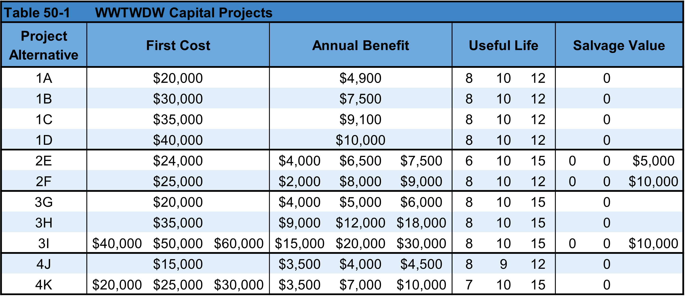
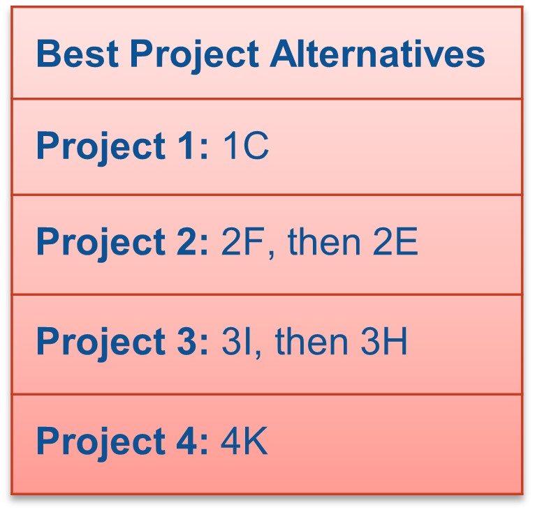
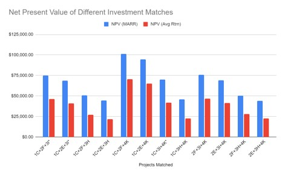

# Introduction
Task was to help We Wish This Were a Deterministic World (WWTWDW) with their capital budgeting. The case is provided 4 projects to pick-and-choose from, each with a set of mutually exclusive alternatives. The projects were defined by a First Cost, Annual Benefit, Useful Life, and Salvage Value. The company has an existing budget of $100,000 and the ability to take out a $10,000 loan at 18%. Minimum attractive rate of return (MARR) of 15%, but WWTWDW averages 20% on its investments.

 

# Methodology 

- Assess the mutually exclusive alternatives within each project to determine the top one or two in each that are worth considering
- Determine the best metric (NPV, ERR, AW, etc) for each project independently
- Perform sensitivity analysis over the changing parameters in each project
- Put together different pairings of the best alternatives that add up    to less than $110,000 and find the most lucrative investment
- Compare NPVs of base case pairings

# Results

- The best option(s) from each Project were listed and then grouped to see the highest NPV investment with the following assumptions:

	- 10-year planning horizon
	- Base-case first costs and annual benefits
	- No salvage value at end of life

- Projects were matched until either the initial costs
	- Were below $100,000, the capital budget
	- Were below $110,000 and a loan was required
	

 

The matching of 1C+2F+4K yielded the highest NPV of the investment options
- $101,196 with MARR
- 70,540 with average return
(Only three pairings required a loan to be taken out)

 

# Conclusion

WWTWDW should invest in the combination of <b> 1C + 2F + 4K </b>
Limitations and further considerations:
- Only used highest net present value as the deciding metric for which alternative to go with
- Payback period is an important factor WWTWDW could want in their decision making
- Only the loan rate was provided, loan duration is a variable factor that would impact the net present value of 3 of the pairs
